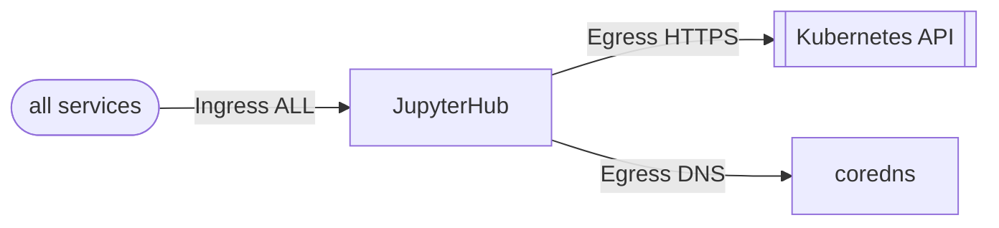

[KEDA](https://keda.sh/) is a Kubernetes-based Event Driven Autoscaler. With KEDA, you can drive the scaling of any container in Kubernetes based on the number of events needing to be processed.

## Development
The following repositories relate to our implementation of this component:
* [Flux](https://github.com/lsc-sde/iac-flux-keda)

## Network Policies

| Direction | Ports/Type | Description |
| --- | --- | --- |
| Ingress | All | Allows all traffic inbound. TODO: This needs to be refined |
| Egress | TCP/UDP 53 | Allows traffic for DNS ports |
| Egress | HTTPS | Allows access to the kubernetes service to allow Kubernetes API Access |